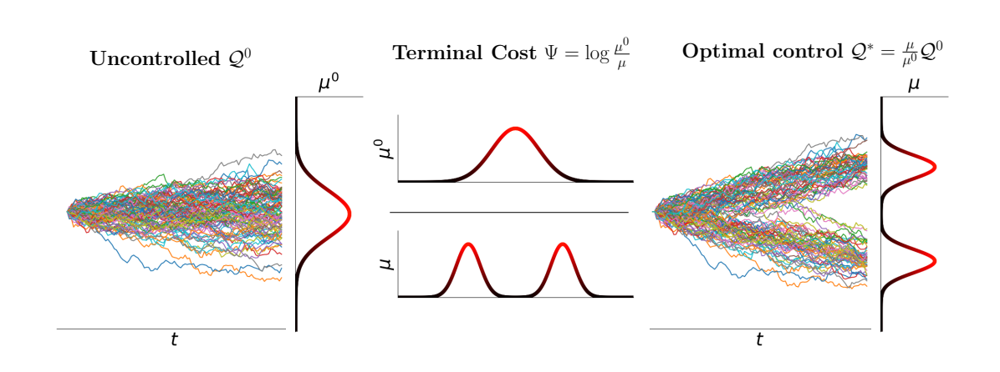

# [Path Integral Sampler: a stochastic control approach for sampling](https://arxiv.org/abs/2111.15141)


[](https://colab.research.google.com/drive/1NOHGt2iHoETgbSh4z7dLep95-zN8FNKL?usp=sharing)



## Setup

The repo heavily depends on [jam](https://github.com/qsh-zh/jam), a versatile toolbox developed by [Qsh.zh](https://github.com/qsh-zh) and [jam-hlt](https://github.com/qsh-zh/jam), a decent deep leanring project template. [⭐️](https://github.com/qsh-zh/jam) if you like them.

*[poetry](https://python-poetry.org/)* (**Recommended**)
```shell
curl -fsS -o /tmp/get-poetry.py https://raw.githubusercontent.com/sdispater/poetry/master/get-poetry.py
python3 /tmp/get-poetry.py -y --no-modify-path
export PATH=$HOME/.poetry/bin:$PATH
poetry shell
poetry install
```

*pip*
```shell
pip install .
```

## Reproduce

```
python run.py experiment=ou.yaml logger=wandb
```

See the [folder](configs/experiment) for more experiment configs.

There are some [results](https://wandb.ai/qinsheng/pub_pis?workspace=user-qinsheng) reproduced by the repo.

## Reference

```tex
@inproceedings{zhang2021path,
  author    = {Qinsheng Zhang and Yongxin Chen},
  title     = {Path Integral Sampler: a stochastic control approach for sampling},
  booktitle = {International Conference on Learning Representations},
  year      = {2022}
}
```

## MICS:

- [sde-sampler](https://gitlab.com/qsh.zh/sde-sampler/-/tree/rings) Uncleaned code used for experiments in paper.
- SDE parameters `dt,g` are modified due to [the issue](https://github.com/google-research/torchsde/issues/109).

## Ideas & Experiments
- Recursive training: could I train a PIS-based optimizer using a PIS-based optimizer, instead of e.g. Adam?
- Integrate D-Adaptation
  - For PIS learning
  - For finding optimal sigma value?
- PIS non-grad net could perform better due to grad computation being expensive
  - Or, could I use some cheap heuristic grads somehow?
  - Compare using different minibatches per grad computation vs same minibatch
- Methods to improve PIS's stability
  - Decaying sigma
  - Gradient clipping
  - Stochastic Weight Averaging?
- Can we somehow initialize PIS to produce weights that correspond with e.g. a xavier initilisation of task model? Solves issue PIS paper mentions of not knowing good prior to use.
  - Though note that an advantage of PIS seems to be that it seems more resiliant to initialisation, maybe? Which means it works on black box models where good init is unclear?